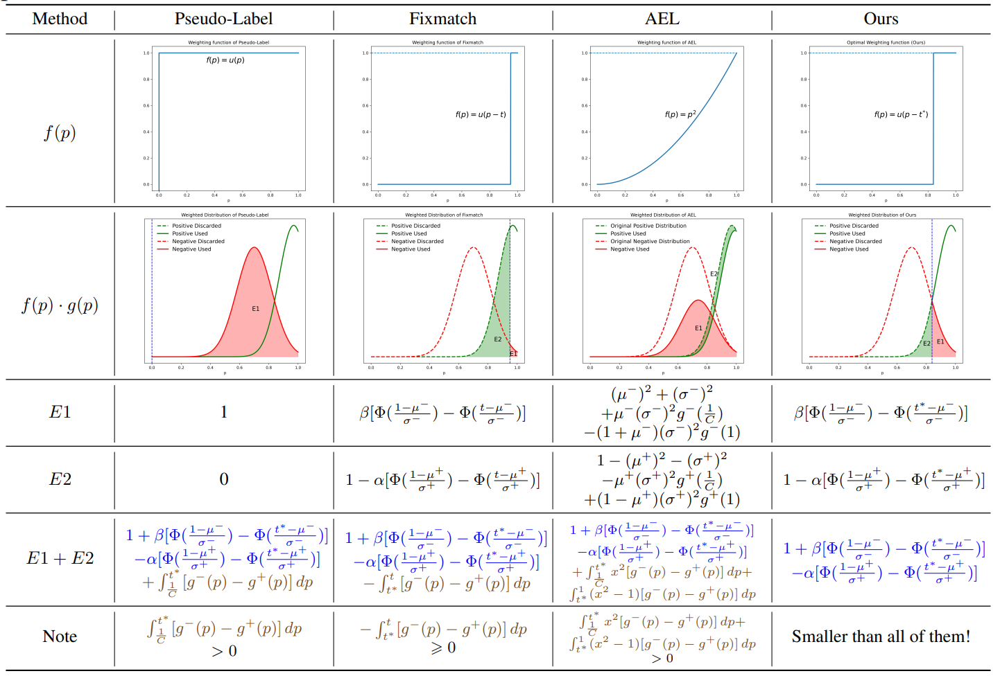

<div align="center">   

# DAW: Exploring the Better Weighting Function for Semi-supervised Semantic Segmentation

</div>

This is the official PyTorch implementation for our NeurIPS 2023 paper "[DAW: Exploring the Better Weighting Function for Semi-supervised Semantic Segmentation](https://proceedings.neurips.cc/paper_files/paper/2023/file/c28ef8449dc21c90696c80ce47b3b5cc-Paper-Conference.pdf)".

## Abstract
The critical challenge of semi-supervised semantic segmentation lies how to fully
exploit a large volume of unlabeled data to improve the model’s generalization
performance for robust segmentation. Existing methods tend to employ certain
criteria (weighting function) to select pixel-level pseudo labels. However, the
trade-off exists between inaccurate yet utilized pseudo-labels, and correct yet
discarded pseudo-labels in these methods when handling pseudo-labels without
thoughtful consideration of the weighting function, hindering the generalization
ability of the model. In this paper, we systematically analyze the trade-off in previous methods when dealing with pseudo-labels. We formally define the trade-off
between inaccurate yet utilized pseudo-labels, and correct yet discarded pseudo labels by explicitly modeling the confidence distribution of correct and inaccurate pseudo-labels, equipped with a unified weighting function. To this end, we
propose Distribution-Aware Weighting (DAW) to strive to minimize the negative
equivalence impact raised by the trade-off. We find an interesting fact that the
optimal solution for the weighting function is a hard step function, with the jump
point located at the intersection of the two confidence distributions. Besides, we
devise distribution alignment to mitigate the issue of the discrepancy between the
prediction distributions of labeled and unlabeled data. Extensive experimental
results on multiple benchmarks including mitochondria segmentation demonstrate
that DAW performs favorably against state-of-the-art methods.
<p align="center">

</p>

## Getting Started

### Installation

```bash
cd DAW
conda create -n daw python=3.10.4
conda activate daw
pip install -r requirements.txt
pip install torch==1.12.1+cu113 torchvision==0.13.1+cu113 -f https://download.pytorch.org/whl/torch_stable.html
```

### Pretrained Backbone

[ResNet-50](https://drive.google.com/file/d/1mqUrqFvTQ0k5QEotk4oiOFyP6B9dVZXS/view?usp=sharing) | [ResNet-101](https://drive.google.com/file/d/1Rx0legsMolCWENpfvE2jUScT3ogalMO8/view?usp=sharing) 

```
├── ./pretrained
    ├── resnet50.pth
    └── resnet101.pth
```

### Dataset

- Pascal: [JPEGImages](http://host.robots.ox.ac.uk/pascal/VOC/voc2012/VOCtrainval_11-May-2012.tar) | [SegmentationClass](https://drive.google.com/file/d/1ikrDlsai5QSf2GiSUR3f8PZUzyTubcuF/view?usp=sharing)
- Cityscapes: [leftImg8bit](https://www.cityscapes-dataset.com/file-handling/?packageID=3) | [gtFine](https://drive.google.com/file/d/1E_27g9tuHm6baBqcA7jct_jqcGA89QPm/view?usp=sharing)

Please modify your dataset path in configuration files.

**The groundtruth masks were preprocessed by [UniMatch](https://github.com/LiheYoung/UniMatch).**

The final folder structure should look like this:
```
├── DAW
	├── pretrained
		└── resnet50.pth, ...
	└── daw.py
	└── ...
├── data
	├── pascal
		├── JPEGImages
		└── SegmentationClass
	├── cityscapes
		├── leftImg8bit
		└── gtFine
```

## Usage

```bash
# use torch.distributed.launch
sh scripts/train.sh <num_gpu> <port>
```


## Citation

If you find this project useful, please consider citing:

## Citation
```bibtext
@inproceedings{sun2023daw,
  title={DAW: Exploring the Better Weighting Function for Semi-supervised Semantic Segmentation},
  author={Sun, Rui and Mai, Huayu and Zhang, Tianzhu and Wu, Feng},
  booktitle={Thirty-seventh Conference on Neural Information Processing Systems},
  year={2023}
}
```

```bibtex
@inproceedings{mai2024rankmatch,
  title={RankMatch: Exploring the Better Consistency Regularization for Semi-supervised Semantic Segmentation},
  author={Mai, Huayu and Sun, Rui and Zhang, Tianzhu and Wu, Feng},
  booktitle={Proceedings of the IEEE/CVF Conference on Computer Vision and Pattern Recognition},
  pages={3391--3401},
  year={2024}
}
```

## Acknowledgements
RankMatch is primarily based on [UniMatch](https://github.com/LiheYoung/UniMatch). 
We are grateful to their authors for open-sourcing their code.